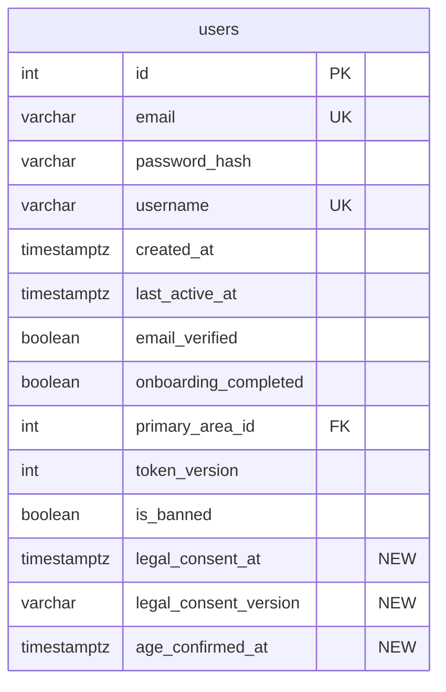

# feat: Implement Clickwrap Consent Flow

## Overview

Replace the passive browsewrap text in the GrabFree mobile app with a legally defensible clickwrap consent mechanism. Add required checkboxes at registration, persist consent and age confirmation to the database, and implement a blocking re-consent modal when legal documents are materially updated.

## Problem Statement

The current app has only passive browsewrap text ("By signing up, you agree to...") with no consent recorded in the database. Courts in NZ/AU increasingly reject browsewrap as insufficient for enforceable agreement. The age confirmation checkbox exists client-side but is never persisted to the backend. There is zero audit trail for user consent.

## Proposed Solution

**Approach A (from brainstorm): Checkbox on registration + blocking modal for re-consent.**

1. **Registration**: Replace browsewrap with a required checkbox linking to all four legal documents (ToS, Privacy Policy, AUP, EULA). Persist consent timestamp, version, and age confirmation to the database.
2. **Re-consent**: When `LEGAL_VERSION` is bumped on the backend, show a blocking modal on app open that cannot be dismissed until the user accepts.
3. **Backend as source of truth**: The backend serves the current `LEGAL_VERSION` in the `/api/auth/me` response, eliminating client/server sync issues during app store rollouts.

## Technical Approach

### Architecture

```
Registration Flow:
  AuthForm.tsx → [age ☐] → [legal consent ☐] → Register button
    ↓
  POST /api/auth/register { email, password, username, legal_consent_version, age_confirmed }
    ↓
  User.create() → INSERT with legal_consent_at, legal_consent_version, age_confirmed_at
    ↓
  OTP → Onboarding → Tabs

Re-consent Flow:
  App open → GET /api/auth/me (returns user + current_legal_version)
    ↓
  getPostAuthRoute() checks: user.legal_consent_version !== current_legal_version?
    ↓
  Yes → Show ConsentModal (blocking, no dismiss)
    ↓
  User taps "I Agree" → POST /api/auth/consent { legal_consent_version }
    ↓
  User.updateConsent() → UPDATE legal_consent_at, legal_consent_version
    ↓
  Modal dismissed → App usable
```

### Post-Auth Routing Order

```
login → verify-email → re-consent → onboarding → tabs
```

Re-consent sits after email verification (user identity must be confirmed first) and before onboarding (user should accept current terms before proceeding).

### Database Schema Change

```sql
-- New migration: scripts/add-consent-tracking.sql
ALTER TABLE users ADD COLUMN IF NOT EXISTS legal_consent_at TIMESTAMPTZ;
ALTER TABLE users ADD COLUMN IF NOT EXISTS legal_consent_version VARCHAR(20);
ALTER TABLE users ADD COLUMN IF NOT EXISTS age_confirmed_at TIMESTAMPTZ;
```

- All columns nullable — existing users will have NULL values
- NULL `legal_consent_version` treated as "never consented" → triggers re-consent modal
- No backfill needed — NULL handling is explicit in comparison logic
- No separate `consent_logs` table (deliberate trade-off: can only prove most recent consent, not historical)
- Migration is idempotent (`IF NOT EXISTS`)



### Implementation Phases

#### Phase 1: Database Migration + Backend Config

Files to modify:
- `scripts/add-consent-tracking.sql` (NEW)
- `src/app.js` (register migration in startup array)
- `src/config/legal.js` (NEW — LEGAL_VERSION constant)

Tasks:
- [x] Create `scripts/add-consent-tracking.sql` with three ALTER TABLE statements
- [x] Create `src/config/legal.js` exporting `LEGAL_VERSION = '2026-03-03'`
- [x] Add migration to the `migrations` array in `src/app.js`

#### Phase 2: Backend Model + Routes

Files to modify:
- `src/models/User.js` (update create, findById; add updateConsent)
- `src/routes/auth.js` (update register; add POST /api/auth/consent; update GET /api/auth/me)
- `src/middleware/validators.js` (add consent validation)

Tasks:
- [x] Update `User.create()` to accept and INSERT `legal_consent_at`, `legal_consent_version`, `age_confirmed_at`
- [x] Update `User.findById()` to SELECT the three new columns
- [x] Add `User.updateConsent(userId, legalConsentVersion)` method
- [x] Update `POST /api/auth/register` to accept `legal_consent_version` and `age_confirmed` fields
- [x] Add backend validation: reject registration if `legal_consent_version !== LEGAL_VERSION` or `age_confirmed !== true`
- [x] Add `POST /api/auth/consent` endpoint (authenticated, validates version matches server LEGAL_VERSION)
- [x] Update `POST /api/auth/consent` to also set `age_confirmed_at` if user's `age_confirmed_at` is NULL and request includes `age_confirmed: true`
- [x] Update `GET /api/auth/me` response to include `current_legal_version` from server config
- [x] Add `registerConsentValidation` and `updateConsentValidation` to validators.js

**API Contract:**

```
POST /api/auth/register
  Request:  { email, password, username, legal_consent_version: string, age_confirmed: boolean }
  Response: { success: true, message: "...", data: { user, token } }
  Errors:   400 "Legal consent is required"
            400 "Legal consent version does not match current version"
            400 "Age confirmation is required"

POST /api/auth/consent (requires authenticate middleware)
  Request:  { legal_consent_version: string, age_confirmed?: boolean }
  Response: { success: true, message: "Legal consent updated" }
  Errors:   400 "Legal consent version does not match current version"
            401 "Unauthorized"

GET /api/auth/me (existing, updated response)
  Response: { success: true, data: { ...user, current_legal_version: "2026-03-03" } }
```

#### Phase 3: Mobile — User Type + API Methods

Files to modify:
- `mobile/services/api.ts` (User interface, API methods)
- `mobile/constants/config.ts` (legal document URLs, fallback LEGAL_VERSION)

Tasks:
- [x] Add `legal_consent_at`, `legal_consent_version`, `age_confirmed_at` to `User` interface in `api.ts`
- [x] Add `current_legal_version` to `User` interface (or auth/me response type)
- [x] Update `authApi.register()` to accept and send `legal_consent_version` and `age_confirmed`
- [x] Add `authApi.updateConsent(legal_consent_version: string, age_confirmed?: boolean)` method
- [x] Add `LEGAL_DOCS_BASE_URL` and individual doc URLs to `config.ts`

#### Phase 4: Mobile — Registration Form

Files to modify:
- `mobile/components/AuthForm.tsx`

Tasks:
- [x] Replace passive browsewrap text with a required checkbox: "I agree to the [Terms of Use], [Privacy Policy], [Acceptable Use Policy], and [End User License Agreement]" — each as a tappable link
- [x] Keep existing age confirmation checkbox, send `age_confirmed: true` to backend
- [x] Disable Register button until both checkboxes are checked AND all fields are valid
- [x] Send `legal_consent_version` (from server or config fallback) with registration request
- [x] Handle consent-specific backend validation errors (display inline)
- [x] Ensure checkboxes retain state after failed submission

**Accessibility requirements:**
- Checkbox labels properly associated with controls for screen readers
- Links within labels distinguishable from checkbox tap target
- Error messages announced to assistive technology

#### Phase 5: Mobile — Re-consent Modal + Auth Flow

Files to modify:
- `mobile/components/ConsentModal.tsx` (NEW)
- `mobile/hooks/useAuth.tsx` (re-consent gate)

Tasks:
- [x] Create `ConsentModal.tsx` using `react-native-paper` Portal + Modal pattern (matching existing dialog patterns)
- [x] Modal is blocking: `dismissable={false}`, `dismissableBackButton={false}`
- [x] Modal displays: heading, explanation text, links to all four legal documents, "I Agree" button
- [x] For users with `age_confirmed_at === null`, also show age confirmation checkbox in the modal
- [x] "I Agree" button disabled while request is in-flight (prevent double-tap)
- [x] On success: update user state, dismiss modal
- [x] On failure: show inline error message within modal ("Something went wrong. Please check your connection and try again."), keep modal blocking, allow retry
- [x] Update `getPostAuthRoute()` in `useAuth.tsx` to add re-consent gate:
  ```typescript
  if (!user.email_verified) return '/(auth)/verify-email';
  // NEW: re-consent check
  if (!user.legal_consent_version || user.legal_consent_version !== user.current_legal_version) {
    // Show consent modal (handled via state in AuthProvider, not a route)
  }
  if (!user.onboarding_completed) return '/onboarding';
  return '/(tabs)';
  ```
- [x] Alternative: manage re-consent as state in `AuthProvider` that renders `ConsentModal` overlay rather than a route, since the modal pattern matches existing dialogs better

#### Phase 6: Integration Testing

Tasks:
- [ ] Test: New user registration with consent — happy path
- [ ] Test: New user registration without checking consent checkbox — button disabled, cannot submit
- [ ] Test: New user registration with mismatched consent version — backend rejects
- [ ] Test: Existing user (NULL consent) opens app — re-consent modal shown
- [ ] Test: User with current consent opens app — no modal, normal flow
- [ ] Test: User with stale consent opens app — re-consent modal shown
- [ ] Test: Re-consent POST fails — modal shows error, allows retry
- [ ] Test: Re-consent POST succeeds — modal dismissed, app usable
- [ ] Test: Existing user with NULL age_confirmed_at — re-consent modal includes age checkbox
- [ ] Test: JWT expires during re-consent — token refresh handles it, or user is redirected to login

## Key Design Decisions

| Decision | Choice | Rationale |
|----------|--------|-----------|
| Consent UX | Required checkbox on registration form | Minimal friction, legally sufficient clickwrap |
| Re-consent mechanism | Blocking modal on app open | Cannot be dismissed, ensures fresh consent |
| DB design | Three columns on users table | Simple, sufficient for free app |
| Audit trail | Overwrite (no consent_logs table) | Deliberate trade-off: only proves most recent consent |
| LEGAL_VERSION source of truth | Backend serves in /me response | Eliminates client/server sync window during rollouts |
| EULA in checkbox | Yes, all four documents | Clickwrap for all binding documents, not just three |
| NULL handling | NULL = "never consented" | Triggers re-consent for all pre-clickwrap users |
| Age for existing users | Re-ask in re-consent modal if NULL | These users never confirmed age to the database |
| Routing order | verify-email → re-consent → onboarding | Identity confirmed before consent, consent before app usage |
| Error recovery in modal | Inline error + retry | Modal stays blocking, user can retry |

## System-Wide Impact

- **Interaction graph**: Registration POST → User.create() → INSERT with consent columns. Re-consent POST → User.updateConsent() → UPDATE. GET /me → includes current_legal_version. No callbacks or observers fire.
- **Error propagation**: Registration validation errors return 400 with field-level messages (existing express-validator pattern). Consent update errors return 400. JWT 401 triggers token refresh (existing middleware). No new error classes.
- **State lifecycle risks**: Re-consent UPDATE is atomic (single row). Registration INSERT is part of existing transaction in User.create(). No orphaned state possible — consent columns are updated in the same row as the user record.
- **API surface parity**: Only the mobile app consumes these endpoints. No web client, no admin panel access to consent. No other interfaces need updating.
- **Integration test scenarios**: (1) Full registration flow with consent → OTP → onboarding. (2) Existing user login → stale consent → modal → accept → app. (3) Registration with missing consent → rejected. (4) Re-consent with network failure → retry → success. (5) JWT expiry during re-consent → refresh → success.

## Acceptance Criteria

- [x] Registration form has required legal consent checkbox linking to ToS, Privacy Policy, AUP, and EULA
- [x] Registration form has age confirmation checkbox (existing, now persisted to DB)
- [x] Register button disabled until both checkboxes checked and all fields valid
- [x] Backend validates consent version matches server LEGAL_VERSION on registration
- [x] Backend validates age_confirmed is true on registration
- [x] `legal_consent_at`, `legal_consent_version`, `age_confirmed_at` persisted to users table on registration
- [x] GET /api/auth/me returns `current_legal_version` from server config
- [x] Re-consent blocking modal shown when `legal_consent_version` is NULL or stale
- [x] Re-consent modal includes age checkbox for users with NULL `age_confirmed_at`
- [x] Re-consent modal cannot be dismissed without accepting
- [x] POST /api/auth/consent updates consent columns and validates version
- [x] Re-consent modal handles network errors with inline error + retry
- [x] Post-auth routing order: verify-email → re-consent → onboarding → tabs
- [x] Migration is idempotent (safe to re-run)
- [x] Existing users with NULL consent see re-consent modal on next app open

## Dependencies & Risks

| Risk | Mitigation |
|------|------------|
| App store rollout delay (client has old LEGAL_VERSION) | Backend is source of truth — client reads current_legal_version from /me response |
| Existing users churn at re-consent gate | One-time ask, minimal friction (single tap), cannot be avoided for legal compliance |
| No historical consent audit trail | Deliberate trade-off documented. Can add consent_logs table later if needed |
| Multiple devices showing modal after consent on one | Minor UX annoyance — user consents again. Not worth solving for v1 |
| Document links point to raw markdown | Documents already hosted at https://apatlingrao55.github.io/grabfree-legal/ as HTML |

## References & Research

### Internal References
- Brainstorm: `docs/brainstorms/2026-03-03-clickwrap-consent-flow-brainstorm.md`
- Legal docs hardening plan: `docs/plans/2026-03-03-feat-harden-legal-docs-statutory-carveouts-aup-plan.md`
- Registration form: `mobile/components/AuthForm.tsx`
- Auth hooks: `mobile/hooks/useAuth.tsx`
- API service: `mobile/services/api.ts`
- Backend auth routes: `src/routes/auth.js`
- User model: `src/models/User.js`
- Validators: `src/middleware/validators.js`
- DB schema: `scripts/init-db.sql`
- App startup/migrations: `src/app.js`
- Modal pattern reference: `mobile/components/ReportDialog.tsx`
- Config constants: `mobile/constants/config.ts`

### Institutional Learnings Applied
- Transaction safety pattern from account deletion solution
- Race condition prevention (disabled button during request) from P1 security fixes
- Idempotent migration pattern from existing scripts
- express-validator field-level error pattern from e2e bug audit
- react-native-paper Portal + Modal pattern from existing dialogs
